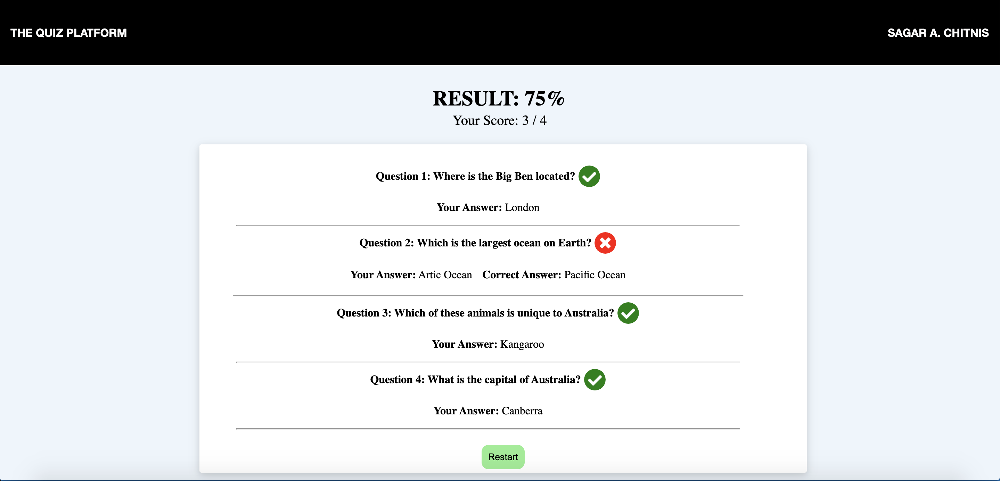

# QUIZZ WEB APP

This project was bootstrapped with [Create React App](https://github.com/facebook/create-react-app).

The questions are stored in a No-SQL db: Firebase

An API call to the firebase database fetches all questions in this quiz to render.

[CLICK HERE](react-quiz-app-2804c.firebaseapp.com) to view the live app.

## Quiz Start Page

## Question Display Page

## Result Display

## Available Scripts

In the project directory, you can run:

### `npm start`

Runs the app in the development mode. 

### `npm test`

Launches the test runner in the interactive watch mode. 

### `npm run build`

Builds the app for production to the `build` folder. 
It correctly bundles React in production mode and optimizes the build for the best performance.
